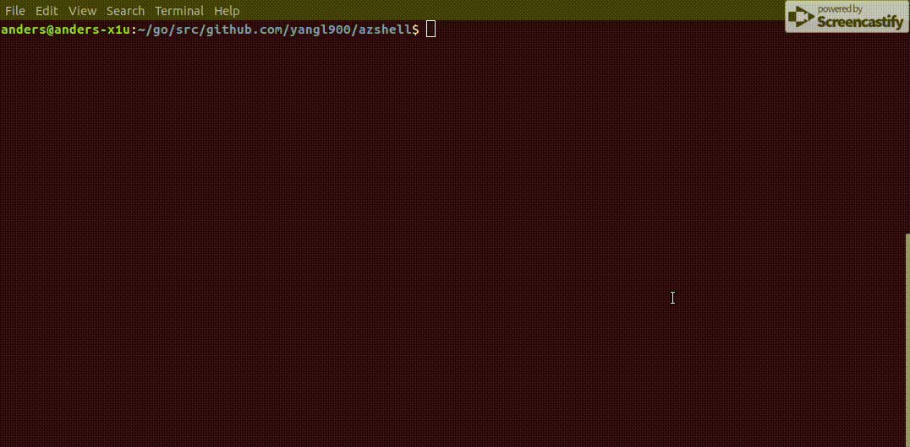

[](https://goreportcard.com/report/github.com/yangl900/azshell)

# azshell
This is an experimental project that allows you connect to Azure Cloud Shell from a local terminal without a browser.

With azshell you will be able to access latest Azure CLI, PowerShell and all other Cloud Shell tooling (terraform, ansible, .net core) from your local command line.

# Installation
azshell is just one binary, copy and use it.

For Linux:
```bash
curl -sL https://github.com/yangl900/azshell/releases/download/v0.1.0/azshell_linux_64-bit.tar.gz | tar xz
```

For Windows (In PowerShell):
```powershell
curl https://github.com/yangl900/azshell/releases/download/v0.1.0/azshell_windows_64-bit.zip -OutFile azshell_windows_64.zip
```
And unzip the file, the only binary needed is `azshell.exe`.

For MacOS:
```bash
curl -sL https://github.com/yangl900/azshell/releases/download/v0.1.0/azshell_macOS_64-bit.tar.gz | tar xz
```

# Usage
Simply type `azshell` and you are good to go. You will be prompt for device login for the first time, and access token will be cached in `$HOME/.azshell`.



## OS support
This should work on Linux, Mac and Windows.

## How to build
Run `make` from the project root. Linux / Mac / Windows binaries will all be built.

## Multiple tenants (not common)
If your account happen to have access to multiple tenants (AAD Directory), you will choose the default tenant for the first time. Later sessions will reuse the preference. To reset the tenant selection, run `azshell --reset`

## Limitations
This is an experimental / prototype project. There are a few things I have not handled:

* The terminal size is hard coded. Cloud Shell has API support, but I have not implemented in this tool to sync the cloud shell terminal size to local terminal size.
* Not all authentication is hooked up. For example Graph and KeyVault CLI won't get the automatic login.
* `download` command is not implemented, but it is possible to implement. Same for upload.

# Contributions and comments
If you like the idea and like to contribute to make this a real tool, contributions are welcome! Any comments are welcome too.

If you'd like to see this become an official tool from Azure, feel free to open issues or post to Azure Cloud Shell [feedback](https://feedback.azure.com/forums/598699-azure-cloud-shell).
